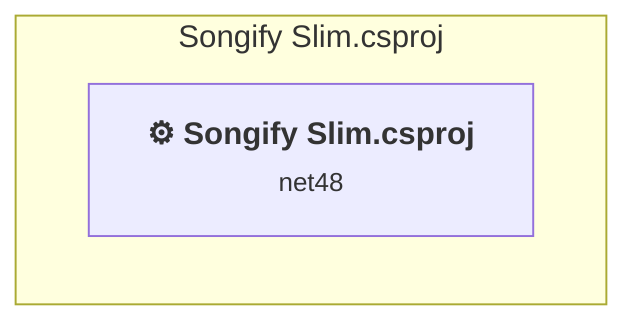

# Projects and dependencies analysis

This document provides a comprehensive overview of the projects and their dependencies in the context of upgrading to .NETCoreApp,Version=v10.0.

## Table of Contents

- [Executive Summary](#executive-Summary)
  - [Highlevel Metrics](#highlevel-metrics)
  - [Projects Compatibility](#projects-compatibility)
  - [Package Compatibility](#package-compatibility)
  - [API Compatibility](#api-compatibility)
  - [Binding Redirect Configuration](#binding-redirect-configuration)
- [Aggregate NuGet packages details](#aggregate-nuget-packages-details)
- [Top API Migration Challenges](#top-api-migration-challenges)
  - [Technologies and Features](#technologies-and-features)
  - [Most Frequent API Issues](#most-frequent-api-issues)
- [Projects Relationship Graph](#projects-relationship-graph)
- [Project Details](#project-details)

  - [Songify Slim\Songify Slim.csproj](#songify-slimsongify-slimcsproj)

## Executive Summary

### Highlevel Metrics

| Metric | Count | Status |
| :--- | :---: | :--- |
| Total Projects | 1 | All require upgrade |
| Total NuGet Packages | 73 | 12 need upgrade |
| Total Code Files | 142 |  |
| Total Code Files with Incidents | 91 |  |
| Total Lines of Code | 39199 |  |
| Total Number of Issues | 8370 |  |
| Estimated LOC to modify | 8308+ | at least 21,2% of codebase |

### Projects Compatibility

| Project | Target Framework | Difficulty | Package Issues | API Issues | Binding Issues | Est. LOC Impact | Description |
| :--- | :---: | :---: | :---: | :---: | :---: | :---: | :--- |
| [Songify Slim\Songify Slim.csproj](#songify-slimsongify-slimcsproj) | net48 | 🟡 Medium | 53 | 8308 | 7 | 8308+ | ClassicWinForms, Sdk Style = False |

### Package Compatibility

| Status | Count | Percentage |
| :--- | :---: | :---: |
| ✅ Compatible | 61 | 83,6% |
| ⚠️ Incompatible | 6 | 8,2% |
| 🔄 Upgrade Recommended | 6 | 8,2% |
| ***Total NuGet Packages*** | ***73*** | ***100%*** |

### API Compatibility

| Category | Count | Impact |
| :--- | :---: | :--- |
| 🔴 Binary Incompatible | 7979 | High - Require code changes |
| 🟡 Source Incompatible | 132 | Medium - Needs re-compilation and potential conflicting API error fixing |
| 🔵 Behavioral change | 197 | Low - Behavioral changes that may require testing at runtime |
| ✅ Compatible | 63305 |  |
| ***Total APIs Analyzed*** | ***71613*** |  |

### Binding Redirect Configuration

| Severity | Count | Description |
| :--- | :---: | :--- |
| 🔴Mandatory | 3 | Must be fixed to avoid runtime failures |
| 🟡Potential | 4 | May cause issues in certain scenarios |
| ***Total Binding Issues*** | ***7*** | ***Across 1 project(s)*** |

## Aggregate NuGet packages details

| Package | Current Version | Suggested Version | Projects | Description |
| :--- | :---: | :---: | :--- | :--- |
| Autoupdater.NET.Official | 1.9.2 |  | [Songify Slim.csproj](#songify-slimsongify-slimcsproj) | ✅Compatible |
| Common.Logging | 3.4.1 |  | [Songify Slim.csproj](#songify-slimsongify-slimcsproj) | ✅Compatible |
| ControlzEx | 5.0.2 |  | [Songify Slim.csproj](#songify-slimsongify-slimcsproj) | ✅Compatible |
| Costura.Fody | 6.1.0 |  | [Songify Slim.csproj](#songify-slimsongify-slimcsproj) | ✅Compatible |
| EmbedIO | 3.5.2 |  | [Songify Slim.csproj](#songify-slimsongify-slimcsproj) | ✅Compatible |
| Fody | 6.9.3 |  | [Songify Slim.csproj](#songify-slimsongify-slimcsproj) | ✅Compatible |
| FuzzySharp | 2.0.2 |  | [Songify Slim.csproj](#songify-slimsongify-slimcsproj) | ✅Compatible |
| HtmlAgilityPack | 1.12.4 |  | [Songify Slim.csproj](#songify-slimsongify-slimcsproj) | ✅Compatible |
| LiveCharts | 0.9.7 |  | [Songify Slim.csproj](#songify-slimsongify-slimcsproj) | ⚠️NuGet package is incompatible |
| LiveCharts.Wpf | 0.9.7 |  | [Songify Slim.csproj](#songify-slimsongify-slimcsproj) | ⚠️NuGet package is incompatible |
| MahApps.Metro | 2.4.11 |  | [Songify Slim.csproj](#songify-slimsongify-slimcsproj) | ✅Compatible |
| MahApps.Metro.IconPacks | 6.2.1 | 4.11.0 | [Songify Slim.csproj](#songify-slimsongify-slimcsproj) | ⚠️NuGet package is incompatible |
| Microsoft.CSharp | 4.7.0 |  | [Songify Slim.csproj](#songify-slimsongify-slimcsproj) | ✅Compatible |
| Microsoft.Extensions.Hosting | 10.0.7 | 10.0.10 | [Songify Slim.csproj](#songify-slimsongify-slimcsproj) | NuGet package upgrade is recommended |
| Microsoft.Extensions.Hosting.Abstractions | 10.0.7 | 10.0.10 | [Songify Slim.csproj](#songify-slimsongify-slimcsproj) | NuGet package upgrade is recommended |
| Microsoft.Extensions.Logging | 10.0.7 | 10.0.10 | [Songify Slim.csproj](#songify-slimsongify-slimcsproj) | NuGet package upgrade is recommended |
| Microsoft.Extensions.Options | 10.0.7 | 10.0.10 | [Songify Slim.csproj](#songify-slimsongify-slimcsproj) | NuGet package upgrade is recommended |
| Microsoft.NETCore.Platforms | 7.0.4 |  | [Songify Slim.csproj](#songify-slimsongify-slimcsproj) | NuGet package functionality is included with framework reference |
| Microsoft.Toolkit.Uwp.Notifications | 7.1.3 |  | [Songify Slim.csproj](#songify-slimsongify-slimcsproj) | ✅Compatible |
| Microsoft.Web.WebView2 | 1.0.3912.50 |  | [Songify Slim.csproj](#songify-slimsongify-slimcsproj) | ✅Compatible |
| Microsoft.Win32.Primitives | 4.3.0 |  | [Songify Slim.csproj](#songify-slimsongify-slimcsproj) | NuGet package functionality is included with framework reference |
| Microsoft.Xaml.Behaviors.Wpf | 1.1.142 | 1.1.39 | [Songify Slim.csproj](#songify-slimsongify-slimcsproj) | ⚠️NuGet package is incompatible |
| NETStandard.Library | 2.0.3 |  | [Songify Slim.csproj](#songify-slimsongify-slimcsproj) | NuGet package functionality is included with framework reference |
| NHttp | 0.1.9 |  | [Songify Slim.csproj](#songify-slimsongify-slimcsproj) | ⚠️NuGet package is incompatible |
| Resource.Embedder | 2.2.0 |  | [Songify Slim.csproj](#songify-slimsongify-slimcsproj) | ✅Compatible |
| SpotifyAPI.Web | 7.4.2 |  | [Songify Slim.csproj](#songify-slimsongify-slimcsproj) | ✅Compatible |
| SpotifyAPI.Web.Auth | 7.4.2 |  | [Songify Slim.csproj](#songify-slimsongify-slimcsproj) | ✅Compatible |
| System.AppContext | 4.3.0 |  | [Songify Slim.csproj](#songify-slimsongify-slimcsproj) | NuGet package functionality is included with framework reference |
| System.Collections | 4.3.0 |  | [Songify Slim.csproj](#songify-slimsongify-slimcsproj) | NuGet package functionality is included with framework reference |
| System.Collections.Concurrent | 4.3.0 |  | [Songify Slim.csproj](#songify-slimsongify-slimcsproj) | NuGet package functionality is included with framework reference |
| System.Console | 4.3.1 |  | [Songify Slim.csproj](#songify-slimsongify-slimcsproj) | NuGet package functionality is included with framework reference |
| System.Diagnostics.Debug | 4.3.0 |  | [Songify Slim.csproj](#songify-slimsongify-slimcsproj) | NuGet package functionality is included with framework reference |
| System.Diagnostics.Tools | 4.3.0 |  | [Songify Slim.csproj](#songify-slimsongify-slimcsproj) | NuGet package functionality is included with framework reference |
| System.Diagnostics.Tracing | 4.3.0 |  | [Songify Slim.csproj](#songify-slimsongify-slimcsproj) | NuGet package functionality is included with framework reference |
| System.Globalization | 4.3.0 |  | [Songify Slim.csproj](#songify-slimsongify-slimcsproj) | NuGet package functionality is included with framework reference |
| System.Globalization.Calendars | 4.3.0 |  | [Songify Slim.csproj](#songify-slimsongify-slimcsproj) | NuGet package functionality is included with framework reference |
| System.IO.Compression | 4.3.0 |  | [Songify Slim.csproj](#songify-slimsongify-slimcsproj) | NuGet package functionality is included with framework reference |
| System.IO.Compression.ZipFile | 4.3.0 |  | [Songify Slim.csproj](#songify-slimsongify-slimcsproj) | NuGet package functionality is included with framework reference |
| System.IO.FileSystem | 4.3.0 |  | [Songify Slim.csproj](#songify-slimsongify-slimcsproj) | NuGet package functionality is included with framework reference |
| System.Linq | 4.3.0 |  | [Songify Slim.csproj](#songify-slimsongify-slimcsproj) | NuGet package functionality is included with framework reference |
| System.Linq.Expressions | 4.3.0 |  | [Songify Slim.csproj](#songify-slimsongify-slimcsproj) | NuGet package functionality is included with framework reference |
| System.Net.Primitives | 4.3.1 |  | [Songify Slim.csproj](#songify-slimsongify-slimcsproj) | NuGet package functionality is included with framework reference |
| System.Net.Sockets | 4.3.0 |  | [Songify Slim.csproj](#songify-slimsongify-slimcsproj) | NuGet package functionality is included with framework reference |
| System.ObjectModel | 4.3.0 |  | [Songify Slim.csproj](#songify-slimsongify-slimcsproj) | NuGet package functionality is included with framework reference |
| System.Reflection | 4.3.0 |  | [Songify Slim.csproj](#songify-slimsongify-slimcsproj) | NuGet package functionality is included with framework reference |
| System.Reflection.Extensions | 4.3.0 |  | [Songify Slim.csproj](#songify-slimsongify-slimcsproj) | NuGet package functionality is included with framework reference |
| System.Reflection.Primitives | 4.3.0 |  | [Songify Slim.csproj](#songify-slimsongify-slimcsproj) | NuGet package functionality is included with framework reference |
| System.Resources.Extensions | 10.0.7 | 10.0.10 | [Songify Slim.csproj](#songify-slimsongify-slimcsproj) | NuGet package upgrade is recommended |
| System.Resources.ResourceManager | 4.3.0 |  | [Songify Slim.csproj](#songify-slimsongify-slimcsproj) | NuGet package functionality is included with framework reference |
| System.Runtime | 4.3.1 |  | [Songify Slim.csproj](#songify-slimsongify-slimcsproj) | NuGet package functionality is included with framework reference |
| System.Runtime.Extensions | 4.3.1 |  | [Songify Slim.csproj](#songify-slimsongify-slimcsproj) | NuGet package functionality is included with framework reference |
| System.Runtime.Handles | 4.3.0 |  | [Songify Slim.csproj](#songify-slimsongify-slimcsproj) | ✅Compatible |
| System.Runtime.InteropServices | 4.3.0 |  | [Songify Slim.csproj](#songify-slimsongify-slimcsproj) | NuGet package functionality is included with framework reference |
| System.Runtime.InteropServices.RuntimeInformation | 4.3.0 |  | [Songify Slim.csproj](#songify-slimsongify-slimcsproj) | NuGet package functionality is included with framework reference |
| System.Runtime.Numerics | 4.3.0 |  | [Songify Slim.csproj](#songify-slimsongify-slimcsproj) | NuGet package functionality is included with framework reference |
| System.Security.Cryptography.Algorithms | 4.3.1 |  | [Songify Slim.csproj](#songify-slimsongify-slimcsproj) | NuGet package functionality is included with framework reference |
| System.Security.Cryptography.X509Certificates | 4.3.2 |  | [Songify Slim.csproj](#songify-slimsongify-slimcsproj) | NuGet package functionality is included with framework reference |
| System.ServiceModel.Http | 10.0.652802 |  | [Songify Slim.csproj](#songify-slimsongify-slimcsproj) | Needs to be replaced with Replace with new package CoreWCF.Primitives=1.9.1;CoreWCF.ConfigurationManager=1.9.1;CoreWCF.Http=1.9.1;CoreWCF.WebHttp=1.9.1;CoreWCF.NetTcp=1.9.1 |
| System.ServiceModel.NetTcp | 10.0.652802 |  | [Songify Slim.csproj](#songify-slimsongify-slimcsproj) | Needs to be replaced with Replace with new package CoreWCF.Primitives=1.9.1;CoreWCF.ConfigurationManager=1.9.1;CoreWCF.Http=1.9.1;CoreWCF.WebHttp=1.9.1;CoreWCF.NetTcp=1.9.1 |
| System.Text.Encoding | 4.3.0 |  | [Songify Slim.csproj](#songify-slimsongify-slimcsproj) | NuGet package functionality is included with framework reference |
| System.Text.Encoding.Extensions | 4.3.0 |  | [Songify Slim.csproj](#songify-slimsongify-slimcsproj) | NuGet package functionality is included with framework reference |
| System.Text.Json | 10.0.7 | 10.0.10 | [Songify Slim.csproj](#songify-slimsongify-slimcsproj) | NuGet package upgrade is recommended |
| System.Text.RegularExpressions | 4.3.1 |  | [Songify Slim.csproj](#songify-slimsongify-slimcsproj) | NuGet package functionality is included with framework reference |
| System.Threading | 4.3.0 |  | [Songify Slim.csproj](#songify-slimsongify-slimcsproj) | NuGet package functionality is included with framework reference |
| System.Threading.Tasks | 4.3.0 |  | [Songify Slim.csproj](#songify-slimsongify-slimcsproj) | NuGet package functionality is included with framework reference |
| System.Threading.Timer | 4.3.0 |  | [Songify Slim.csproj](#songify-slimsongify-slimcsproj) | NuGet package functionality is included with framework reference |
| System.Xml.ReaderWriter | 4.3.1 |  | [Songify Slim.csproj](#songify-slimsongify-slimcsproj) | NuGet package functionality is included with framework reference |
| System.Xml.XDocument | 4.3.0 |  | [Songify Slim.csproj](#songify-slimsongify-slimcsproj) | NuGet package functionality is included with framework reference |
| TwitchLib.Api | 3.10.2 |  | [Songify Slim.csproj](#songify-slimsongify-slimcsproj) | ✅Compatible |
| TwitchLib.Client | 4.0.1 |  | [Songify Slim.csproj](#songify-slimsongify-slimcsproj) | ✅Compatible |
| TwitchLib.EventSub.Websockets | 0.8.0 |  | [Songify Slim.csproj](#songify-slimsongify-slimcsproj) | ✅Compatible |
| WPF-UI | 4.3.0 | 2.0.3 | [Songify Slim.csproj](#songify-slimsongify-slimcsproj) | ⚠️NuGet package is incompatible |
| YamlDotNet | 17.1.0 |  | [Songify Slim.csproj](#songify-slimsongify-slimcsproj) | ✅Compatible |

## Top API Migration Challenges

### Technologies and Features

| Technology | Issues | Percentage | Migration Path |
| :--- | :---: | :---: | :--- |
| WPF (Windows Presentation Foundation) | 4630 | 55,7% | WPF APIs for building Windows desktop applications with XAML-based UI that are available in .NET on Windows. WPF provides rich desktop UI capabilities with data binding and styling. Enable Windows Desktop support: Option 1 (Recommended): Target net9.0-windows; Option 2: Add <UseWindowsDesktop>true</UseWindowsDesktop>. |
| Windows Forms | 79 | 1,0% | Windows Forms APIs for building Windows desktop applications with traditional Forms-based UI that are available in .NET on Windows. Enable Windows Desktop support: Option 1 (Recommended): Target net9.0-windows; Option 2: Add <UseWindowsDesktop>true</UseWindowsDesktop>; Option 3 (Legacy): Use Microsoft.NET.Sdk.WindowsDesktop SDK. |
| GDI+ / System.Drawing | 42 | 0,5% | System.Drawing APIs for 2D graphics, imaging, and printing that are available via NuGet package System.Drawing.Common. Note: Not recommended for server scenarios due to Windows dependencies; consider cross-platform alternatives like SkiaSharp or ImageSharp for new code. |
| Windows Forms Legacy Controls | 16 | 0,2% | Legacy Windows Forms controls that have been removed from .NET Core/5+ including StatusBar, DataGrid, ContextMenu, MainMenu, MenuItem, and ToolBar. These controls were replaced by more modern alternatives. Use ToolStrip, MenuStrip, ContextMenuStrip, and DataGridView instead. |

### Most Frequent API Issues

| API | Count | Percentage | Category |
| :--- | :---: | :---: | :--- |
| T:System.Windows.RoutedEventHandler | 696 | 8,4% | Binary Incompatible |
| T:System.Windows.Application | 431 | 5,2% | Binary Incompatible |
| T:System.Windows.Visibility | 309 | 3,7% | Binary Incompatible |
| T:System.Windows.Controls.TextBox | 263 | 3,2% | Binary Incompatible |
| T:System.Windows.Controls.Button | 231 | 2,8% | Binary Incompatible |
| T:System.Windows.RoutedEventArgs | 206 | 2,5% | Binary Incompatible |
| P:System.Windows.Application.Current | 201 | 2,4% | Binary Incompatible |
| T:System.Windows.Controls.TextBlock | 194 | 2,3% | Binary Incompatible |
| T:System.Windows.Controls.CheckBox | 176 | 2,1% | Binary Incompatible |
| T:System.Windows.Controls.ComboBox | 170 | 2,0% | Binary Incompatible |
| P:System.Windows.Controls.TextBox.Text | 111 | 1,3% | Binary Incompatible |
| T:System.Uri | 101 | 1,2% | Behavioral Change |
| P:System.Windows.Controls.TextBlock.Text | 100 | 1,2% | Binary Incompatible |
| T:System.Windows.Controls.MenuItem | 99 | 1,2% | Binary Incompatible |
| E:System.Windows.Controls.Primitives.ButtonBase.Click | 96 | 1,2% | Binary Incompatible |
| P:System.Windows.UIElement.Visibility | 92 | 1,1% | Binary Incompatible |
| T:System.Windows.Threading.Dispatcher | 91 | 1,1% | Binary Incompatible |
| P:System.Windows.Threading.DispatcherObject.Dispatcher | 91 | 1,1% | Binary Incompatible |
| T:System.Windows.Media.Brush | 77 | 0,9% | Binary Incompatible |
| T:System.Windows.Media.SolidColorBrush | 76 | 0,9% | Binary Incompatible |
| P:System.Windows.Controls.ContentControl.Content | 75 | 0,9% | Binary Incompatible |
| T:System.Windows.Controls.TextChangedEventHandler | 72 | 0,9% | Binary Incompatible |
| T:System.Windows.Controls.SelectionChangedEventHandler | 70 | 0,8% | Binary Incompatible |
| M:System.Windows.Application.TryFindResource(System.Object) | 69 | 0,8% | Binary Incompatible |
| T:System.Windows.Controls.Grid | 59 | 0,7% | Binary Incompatible |
| T:System.Windows.Window | 59 | 0,7% | Binary Incompatible |
| T:System.Windows.Threading.DispatcherPriority | 58 | 0,7% | Binary Incompatible |
| T:System.Windows.Controls.Border | 57 | 0,7% | Binary Incompatible |
| F:System.Windows.Visibility.Visible | 57 | 0,7% | Binary Incompatible |
| T:System.Windows.Controls.ItemCollection | 57 | 0,7% | Binary Incompatible |
| P:System.Windows.Controls.ItemsControl.Items | 57 | 0,7% | Binary Incompatible |
| T:System.Windows.Threading.DispatcherTimer | 57 | 0,7% | Binary Incompatible |
| T:System.Windows.Controls.DataGrid | 55 | 0,7% | Binary Incompatible |
| P:System.Windows.Controls.Primitives.ToggleButton.IsChecked | 49 | 0,6% | Binary Incompatible |
| T:System.Windows.Controls.Image | 48 | 0,6% | Binary Incompatible |
| F:System.Windows.Visibility.Collapsed | 47 | 0,6% | Binary Incompatible |
| T:System.Windows.Thickness | 46 | 0,6% | Binary Incompatible |
| P:System.Windows.FrameworkElement.Tag | 46 | 0,6% | Binary Incompatible |
| T:System.Windows.Controls.StackPanel | 45 | 0,5% | Binary Incompatible |
| E:System.Windows.Controls.MenuItem.Click | 42 | 0,5% | Binary Incompatible |
| E:System.Windows.Controls.Primitives.ToggleButton.Checked | 42 | 0,5% | Binary Incompatible |
| M:System.TimeSpan.FromSeconds(System.Double) | 40 | 0,5% | Source Incompatible |
| T:System.Windows.Media.Brushes | 40 | 0,5% | Binary Incompatible |
| E:System.Windows.Controls.Primitives.ToggleButton.Unchecked | 38 | 0,5% | Binary Incompatible |
| T:System.Windows.Media.Color | 37 | 0,4% | Binary Incompatible |
| T:System.Windows.Controls.PasswordBox | 37 | 0,4% | Binary Incompatible |
| E:System.Windows.Controls.Primitives.TextBoxBase.TextChanged | 36 | 0,4% | Binary Incompatible |
| T:System.Windows.Controls.TextChangedEventArgs | 36 | 0,4% | Binary Incompatible |
| E:System.Windows.Controls.Primitives.Selector.SelectionChanged | 35 | 0,4% | Binary Incompatible |
| T:System.Windows.Controls.UIElementCollection | 34 | 0,4% | Binary Incompatible |

## Projects Relationship Graph

Legend:
📦 SDK-style project
⚙️ Classic project

## Project Details

### Songify Slim\Songify Slim.csproj

#### Project Info

- **Current Target Framework:** net48
- **Proposed Target Framework:** net10.0-windows
- **SDK-style**: False
- **Project Kind:** ClassicWinForms
- **Dependencies**: 0
- **Dependants**: 0
- **Number of Files**: 162
- **Number of Files with Incidents**: 91
- **Lines of Code**: 39199
- **Estimated LOC to modify**: 8308+ (at least 21,2% of the project)

#### Dependency Graph

Legend:
📦 SDK-style project
⚙️ Classic project

### API Compatibility

| Category | Count | Impact |
| :--- | :---: | :--- |
| 🔴 Binary Incompatible | 7979 | High - Require code changes |
| 🟡 Source Incompatible | 132 | Medium - Needs re-compilation and potential conflicting API error fixing |
| 🔵 Behavioral change | 197 | Low - Behavioral changes that may require testing at runtime |
| ✅ Compatible | 63305 |  |
| ***Total APIs Analyzed*** | ***71613*** |  |

#### Binding Redirect Configuration

| Rule | Severity | Details | Recommendation |
| :--- | :---: | :--- | :--- |
| Missing binding redirect for referenced assembly | 🟡Potential | Manual redirects exist but none covers Microsoft.CSharp (referenced v4.0.0.0, package v4.7.0) | Add a binding redirect for the missing assembly. |
| Manual redirect conflicts with auto-generated version | 🔴Mandatory | Manual redirect for ControlzEx targets 5.0.0.0 but auto-generation would target 5.0.2 (MSB3836 conflict) | Remove the conflicting manual binding redirect or disable auto-generation. |
| Manual redirect conflicts with auto-generated version | 🔴Mandatory | Manual redirect for System.Text.Json targets 8.0.0.4 but auto-generation would target 10.0.7 (MSB3836 conflict) | Remove the conflicting manual binding redirect or disable auto-generation. |
| Manual redirect conflicts with auto-generated version | 🔴Mandatory | Manual redirect for Microsoft.Extensions.Options targets 8.0.0.2 but auto-generation would target 10.0.7 (MSB3836 conflict) | Remove the conflicting manual binding redirect or disable auto-generation. |
| Binding redirect forces version downgrade | 🟡Potential | Binding redirect for ControlzEx targets 5.0.0.0 but package provides 5.0.2 | Update the binding redirect newVersion to match the version provided by the NuGet package. |
| Binding redirect forces version downgrade | 🟡Potential | Binding redirect for Microsoft.Extensions.Options targets 8.0.0.2 but package provides 10.0.7 | Update the binding redirect newVersion to match the version provided by the NuGet package. |
| Binding redirect forces version downgrade | 🟡Potential | Binding redirect for System.Text.Json targets 8.0.0.4 but package provides 10.0.7 | Update the binding redirect newVersion to match the version provided by the NuGet package. |

#### Project Technologies and Features

| Technology | Issues | Percentage | Migration Path |
| :--- | :---: | :---: | :--- |
| Windows Forms Legacy Controls | 16 | 0,2% | Legacy Windows Forms controls that have been removed from .NET Core/5+ including StatusBar, DataGrid, ContextMenu, MainMenu, MenuItem, and ToolBar. These controls were replaced by more modern alternatives. Use ToolStrip, MenuStrip, ContextMenuStrip, and DataGridView instead. |
| Windows Forms | 79 | 1,0% | Windows Forms APIs for building Windows desktop applications with traditional Forms-based UI that are available in .NET on Windows. Enable Windows Desktop support: Option 1 (Recommended): Target net9.0-windows; Option 2: Add <UseWindowsDesktop>true</UseWindowsDesktop>; Option 3 (Legacy): Use Microsoft.NET.Sdk.WindowsDesktop SDK. |
| GDI+ / System.Drawing | 42 | 0,5% | System.Drawing APIs for 2D graphics, imaging, and printing that are available via NuGet package System.Drawing.Common. Note: Not recommended for server scenarios due to Windows dependencies; consider cross-platform alternatives like SkiaSharp or ImageSharp for new code. |
| WPF (Windows Presentation Foundation) | 4630 | 55,7% | WPF APIs for building Windows desktop applications with XAML-based UI that are available in .NET on Windows. WPF provides rich desktop UI capabilities with data binding and styling. Enable Windows Desktop support: Option 1 (Recommended): Target net9.0-windows; Option 2: Add <UseWindowsDesktop>true</UseWindowsDesktop>. |

